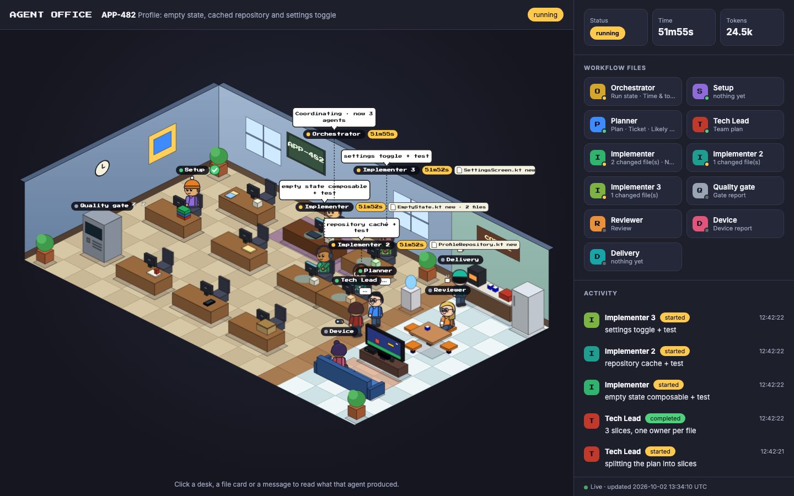
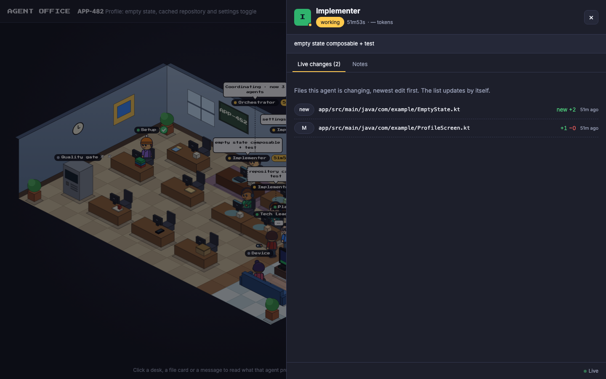

# Android Workflow Kit

A tool-agnostic kit for running Android tickets end to end with coding agents
(Claude Code, Codex, Cursor, Gemini CLI / Antigravity and any
[Agent Skills](https://agentskills.io) host). The agent writes the code; a
standard-library Python CLI detects the project, localizes the change, runs the
quality gate and device checks, and refuses to finish without a real source diff.

**Goal:** a precise PR, fast and cheap to produce.

```text
Input (Jira / description) → Orchestrator (setup, branch, level)
  → Planner → Implementer (code + unit tests) → Quality gate → Code reviewer → Device check → Delivery (commit, push, PR)
      fix rounds: gate / reviewer / device ──→ Implementer
      independent parts: Tech Lead → up to 3 Implementers at once → Tech Lead integrates → Quality gate
```

The workflow is described in one place: [`skills/android-workflow/SKILL.md`](skills/android-workflow/SKILL.md).
The repository mirrors `~/.ai`, which is where every host reads it from.

## Layout

| Path | What it is |
| --- | --- |
| `.claude/`, `.codex/`, `.cursor/`, `.gemini/`, `.agents/` | Ready-made folders for each tool. They hold only pointers: links to the skills and small agent files that say "read `~/.ai/skills/android-workflow/agents/aw-…md`". |
| `link.sh` | One-time setup: links those folders into your home so every tool finds them. |
| `skills/android-workflow/SKILL.md` | The workflow: stages, agents, levels, stops and delivery rules (single source of truth). |
| `skills/android-workflow/agents/` | The seven `aw-*` agents: setup, planner, tech lead, implementer, reviewer, device, delivery. |
| `skills/device-driving/` | How the Device agent drives the phone or emulator (Maestro first, adb fallback). |
| `tools/android-workflow/` | The Python package behind the `android-workflow` CLI, with its tests. |
| `bin/` | `android-workflow` launcher plus the helpers the CLI calls: `feature_setup.py` (project profile), `feature_workspace.py` (ticket branch/worktree) and `android_probe.py`. |

## Install

Requires Python 3.9+ (the `python3` that ships with macOS is enough; standard library only).

```bash
git clone https://github.com/arctouch-douglasfornaro/android-workflow-kit.git ~/.ai
```

Then, once:

```bash
~/.ai/link.sh
```

It links `~/.claude`, `~/.codex`, `~/.cursor`, `~/.gemini` and `~/.agents` to the matching folder in
this kit and enables `multi_agent_v2` in `~/.codex/config.toml` (Codex needs it to spawn agents).
Anything already there with the same name is moved to `~/.ai-backup/`, never deleted.

Everything points at one source of truth, so edits to the workflow apply at once in every tool. Run
`link.sh` again only when the kit adds or removes an agent or skill.

## Use

### 1. Requirements on your machine

| Needed for | What |
| --- | --- |
| Always | Python 3.9+ (macOS already has it), `git`, and an Android project that builds with Gradle |
| Opening the PR | `gh` (GitHub) or `glab` (GitLab), logged in. Without it you get a link to open the PR by hand |
| Device check | A phone or emulator in `adb devices`, or just an emulator created once in Android Studio (Device Manager): the workflow opens it when nothing is connected. Maestro is installed automatically on first use |
| Jira tickets | A Jira connector (MCP) in your coding tool, so the ticket text is fetched for you |

**Claude Code in auto mode:** allow the workflow's CLI once, so its own git steps (commit, push, PR,
all done by `CLI deliver`) never wait on a safety check. In `~/.claude/settings.json`:

```json
{ "permissions": { "allow": ["Bash(python3 ~/.ai/bin/android-workflow:*)"] } }
```

### 2. Run it

Open the **Android app's folder** in your coding tool and type:

```text
/android-workflow APP-123 Show empty state on the profile screen
```

On Codex use `$android-workflow`. The first argument is the ticket id (a Jira key works); the rest
is the task. That's all: the workflow creates the branch, writes the code and tests, checks
everything and opens the PR.

**Without any flag**, this is what the workflow decides for you. Add a flag at the end of the
command only to change one of them:

| What | Default (no flag) | Flag to change it |
| --- | --- | --- |
| App | The folder your tool is opened in (it must have `settings.gradle`) | `--target PATH` |
| Branch | On `main` (or the repo's base branch): creates `<user>/<TICKET>-<slug>` in the same checkout. On any other branch: keeps working on it | `--worktree` to work in a separate folder instead |
| PR base | The repo's default branch (`origin/HEAD`, else `main`, `master` or `develop`) | `--base BRANCH` |
| Depth | Chosen from the ticket: `express` for a small, clear change (no Planner); `full` for risky areas (lifecycle, migrations, payments, auth); `standard` otherwise. Bugs are never `express` | `--level express\|standard\|full` |
| Device check | Runs when the change is visible or runtime. No device connected: it opens your emulator (the AVD in `device.avd` of `.ai/android-workflow.json`, else the first one) and closes it at the end; a device you connected or opened is never closed. No emulator at all: skipped, and the PR says it was not verified on a device | `--no-device` to always skip it |
| Delivery | Commits, pushes and opens the PR (a draft if some check is still failing) | `--no-pr`, `--no-push` or `--no-commit` to stop earlier |

### 3. What happens

1. **Branch** — on the base branch it creates `<user>/<TICKET>-<slug>`; on any other branch it keeps working there.
2. **Setup (first run only)** — learns the project's patterns and quality tools and saves them in `.ai/project-profile.md`. Later tickets reuse it.
3. **Depth** — picks `express`, `standard` or `full` from the ticket (see *Depth* in the table above).
4. **Planner** — reads the code and writes verifiable acceptance criteria. Meanwhile the emulator boots (when no device is connected) and the unchanged app is built in the background.
5. **Implementer** — writes the change and the unit tests that prove it. In parallel, if a device is connected, the **before** screenshots are captured.
   When the plan has independent parts (different modules, data and UI) the **Tech Lead** splits it into slices, up to
   **3 Implementers** build them at the same time, each owning its own files, and the Tech Lead integrates them before the gate.
6. **Quality gate** — formatter, compile, unit tests, detekt and lint for the modules touched. Failures go back to the Implementer (up to 2 times).
7. **Code reviewer** — an independent review of the diff: bugs, side effects, callers, duplication, project conventions. Blocking findings go back to the Implementer once.
8. **Device check** — installs the app, navigates to the change and captures the **after** screenshots or video.
9. **PR** — commits only app code, pushes and opens the PR.

You see one line per stage in the chat, e.g. `Reviewer: approved, 0 blocking → review.json`.

### 4. What you get

- **A PR, every time code was written.** Ready for review when every check passed; a **draft** that
  lists what is still open when a check kept failing (gate, review or device). The commit and PR
  carry no tool or AI attribution and follow the repo's PR template when there is one.
- **Before/after evidence** in `.ai/workflow/<TICKET>/media/before/` and `media/after/`, plus
  `media/compare.md`. Drag them into the PR.
- **A log of the run** in `.ai/workflow/<TICKET>/stage-log.md`, with time and tokens per stage in
  `stage-metrics.json` to spot what was slow or expensive.

Everything under `.ai/workflow/` stays on your machine; it is git-ignored and never committed.

### 5. Watch the agents work

The workflow keeps a page that shows the run as an isometric office, Habbo style: one desk per agent
(plus the Tech Lead and extra Implementers when a team works), a corridor and a coffee room. Only the agents doing work sit at their desk; the others follow a
deterministic routine — coffee, a chat in the corridor, the console in front of the TV, the window,
a game at their desk —
and walk back as soon as they get work. It is **live**: each working agent's clock counts second by
second next to its name, the file the Implementer is editing shows up on its line (and in its
**Live changes** tab, with lines added and removed) as soon as it is saved, and new activity lands in
the chat within a couple of seconds, without reloading the page or closing the panel you are reading.
The page also shows who sent work back for a fix, time and tokens per agent, the run's activity as a
chat and every past run of the app. **Click any desk,
agent, file card or message** to read what that agent produced, formatted: the plan and acceptance
criteria, the implementation notes and changed files, every quality-gate check (with the Gradle
logs), the review's blocking points and suggestions, the device report with before/after
screenshots (side by side or with a slider), and the PR description.





The link appears in the chat when a run starts. To open it yourself, from the app's folder:

```bash
python3 ~/.ai/bin/android-workflow office --target .
```

It is a local file (`.ai/workflow/office.html`); nothing leaves your machine. While a run is live a
small background process keeps it current between commands; it stops by itself when the run ends.

### 6. When it stops to ask you

It only stops **before writing code**, when it would otherwise have to guess: a business rule the
ticket does not define, a bug without steps to reproduce it, or a project fact Setup could not find.
Answer in the chat and it continues.

### 7. Cleaning up old runs (optional)

Each run leaves its files (plan, notes, log, screenshots) in `.ai/workflow/<TICKET>/` inside the app.
They never go to git, but they pile up, one folder per ticket. From the app's folder:

```bash
python3 ~/.ai/bin/android-workflow list  --target .                    # which tickets have run here
python3 ~/.ai/bin/android-workflow clean --target . --ticket APP-123   # delete one ticket's files
python3 ~/.ai/bin/android-workflow clean --target .                    # delete them all
```

The project profile (`.ai/project-profile.md`) is kept, so the next run does not redo Setup.

### 8. Updating the kit

If you installed with `git clone`, run `git -C ~/.ai pull` to get the newest version. Every tool
uses it at once; nothing else to do.

More: the full workflow rules are in [`skills/android-workflow/SKILL.md`](skills/android-workflow/SKILL.md)
and the CLI reference in [`tools/android-workflow/README.md`](tools/android-workflow/README.md).

## Tests

```bash
cd ~/.ai/tools/android-workflow && python3 -m unittest discover -s tests
cd ~/.ai/bin && python3 -m unittest discover -p '*_test.py'
```
