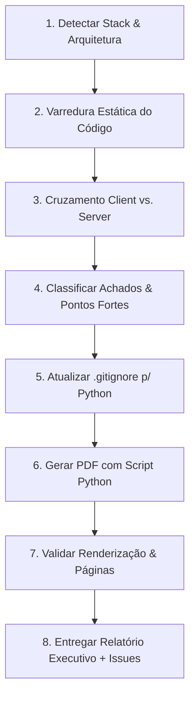

# Security Audit (Auditoria Defensiva de Segurança)

Esta skill guia o agente na execução de uma auditoria completa de segurança em qualquer repositório, mapeando a análise para a stack tecnológica real do projeto, identificando pontos fortes e vulnerabilidades, gerando um relatório executivo diagramado em PDF (A4) com gráficos de alta fidelidade e produzindo issues completas para o GitHub com critérios de aceite testáveis.

---

## 🎯 Quando Usar

- Ao solicitar uma auditoria de segurança completa no repositório ("audita a segurança do código", "revisa atrás de falhas de segurança", "pentest de código-fonte").
- Antes de lançamentos em produção, auditorias externas ou rodadas de captação/due diligence técnica.
- Ao avaliar isolamento multi-tenant, controle de acesso (RBAC/ABAC), regras de banco, IDORs, vazamento de segredos e higienização de inputs.
- Quando for solicitado um relatório executivo em PDF com gráficos de severidade e templates de issues para o GitHub.

---

## 🛡️ As 5 Categorias de Segurança (Adaptadas por Stack)

Antes de iniciar qualquer análise, **detecte a stack completa** do projeto (Linguagem, Framework Web/Backend, ORM/Query Builder/BaaS, Autenticação, Frontend, Infra/Deploy/CI) e adapte cada categoria ao equivalente técnico dessa arquitetura:

### 1. BANCO SEM TRANCA (Isolamento de Tenant / Dono / Workspace)
*O que buscar:* Queries, mutations, regras de banco ou endpoints que não filtram pelo usuário autenticado ou pelo tenant/workspace/organização legítima.
- **Supabase / PostgreSQL:** Row Level Security (RLS) habilitado em todas as tabelas? Políticas cobrem `SELECT`, `INSERT`, `UPDATE`, `DELETE`? Uso indevido de `service_role` key no frontend/Edge Functions contornando RLS?
- **Firebase / Firestore:** `firestore.rules` e `storage.rules` com política *default deny*? Regras hierárquicas em `/users/{userId}/*` checam `request.auth.uid == userId`? Funções auxiliares (ex: `profilePrivilegedUnchanged`) impedem escalonamento de campos como `isAdmin`, `isPremium`, `role`, saldo/créditos?
- **APIs Próprias / ORMs (Prisma, TypeORM, Drizzle, SQLAlchemy, Django ORM, Hibernate):** Existe middleware de tenant/organização? As queries de listagem, busca, agregação, relatório e exportação (`findMany`, `filter`, `select`) incluem obrigatoriamente `where: { tenantId, userId }` derivado do token JWT de sessão validado no backend?

### 2. PERMISSÃO DEFINIDA NO NAVEGADOR (Client-Side-Only Gates)
*O que buscar:* Operações privilegiadas (admin, painéis gerenciais, faturamento, alteração de planos, moderação, deleção em massa) em que a interface oculta elementos por papel (`isAdmin`, `role === 'admin'`, `canEdit`, `isPremium`), mas o servidor/API **NÃO** faz a verificação equivalente.
- **Análise Cruzada:** Mapeie cada verificação de papel no frontend (guards de rota, condicionais de renderização) e localize o endpoint/resolver/função de backend correspondente.
- **Verificação Server-Side:** O backend valida a claim/role no token JWT verificado ou na sessão de banco? Se o usuário fizer a chamada HTTP/gRPC/GraphQL diretamente via `curl` ou Postman, a operação é rejeitada com 401/403?

### 3. IDOR (Insecure Direct Object Reference)
*O que buscar:* IDs diretos (`user_id`, `document_id`, `uuid`, `order_id`, `chat_id`) recebidos via URL, query params, body ou webhooks sem verificação se o usuário logado é o proprietário legítimo do recurso.
- **Leituras e Mutações Diretas:** Rotas do tipo `GET /api/documents/:id` ou `POST /api/settings/update` que usam o ID fornecido pelo cliente para buscar no banco em vez de usar o ID da sessão autenticada.
- **Janelas de Transição / Bypass de Tokens:** Endpoints de descadastro (`/unsubscribe`), recuperação de senha ou confirmação que aceitam chamadas sem token HMAC assinado ou com tokens expirados.
- **Vinculação de Identificadores Externos:** Integrações com bots (Telegram Chat ID, WhatsApp number, Discord ID) que gravam identificadores sem handshake criptográfico, OTP ou comando `/start <token>`, permitindo associar IDs de terceiros.

### 4. CHAVES EXPOSTAS & DEFAULTS INSEGUROS (Hardcode)
*O que buscar:* Segredos privados, chaves de API, credenciais de banco, service accounts ou fallbacks inseguros presentes no código-fonte, bundles de frontend, configs ou histórico git.
- **Hardcode no Código:** Constantes com tokens de API (`sk_live_...`, `AIza...`, `ghp_...`, `whsec_...`) ou fallbacks inseguros (`process.env.SECRET || 'dummy_key'`).
- **Exposição no Frontend:** Variáveis expostas no build do cliente (`VITE_*`, `NEXT_PUBLIC_*`, `REACT_APP_*`) contendo segredos que deveriam ser exclusivos do backend.
- **Git & Configurações:** Arquivos `.env` commitados, ausência de regras no `.gitignore`, ou scripts de setup sem uso de Secret Manager.

### 5. INPUTS SEM TRATAMENTO (XSS & Injeções)
*O que buscar:* Dados controlados pelo usuário renderizados como HTML ou código sem sanitização ou escape de entidades.
- **Frontend / SPA:** `dangerouslySetInnerHTML`, `v-html`, manipulação direta de DOM (`innerHTML`), Markdown renderizado com flags de HTML cru (ex: `rehype-raw` sem sanitizador), links com esquemas inseguros (`href="javascript:..."`), chamadas a `eval()` ou `new Function()`.
- **E-mails Transacionais & Notificações:** Interpolação de dados de perfil (`name`, `firstName`, `custom_field`) diretamente em strings HTML de templates de e-mail (Resend, SendGrid, SES) sem função de escape HTML (`&`, `<`, `>`, `"`, `'`).
- **Mensageria & Bots:** Envio de mensagens formatadas (Telegram HTML/Markdown, WhatsApp) sem escapar caracteres especiais reservados (`<`, `>`, `&`), gerando injeção visual ou quebra silenciosa de entrega (erro 400 da API).

---

## 📋 Fluxo de Execução da Auditoria



### Passo 1 — Detecção e Mapeamento da Stack
Inspecione arquivos-chave de configuração (`package.json`, `requirements.txt`, `go.mod`, `pom.xml`, `Dockerfile`, `firebase.json`, `supabase/config.toml`, `.env.example`) para mapear:
1. Linguagem e Frameworks (Front e Back).
2. Mecanismo de persistência e isolamento (RLS, regras NoSQL, ORM).
3. Mecanismo de autenticação e claims (JWT, sessões, Firebase Auth, Auth0, Clerk).
4. Infraestrutura e serviços externos (Stripe, gateways, mensageria, IA).

### Passo 2 — Varredura Estática e Cruzamento
Percorra o código-fonte arquivo por arquivo:
- Verifique regras de banco e storage.
- Trace todas as rotas e funções de backend, inspecionando como o ID do usuário é validado.
- Verifique todos os pontos onde dados do usuário entram em HTML, e-mails, webhooks ou queries.
- Audite todas as variáveis de ambiente, fallbacks e bundles do frontend.

### Passo 3 — Higiene do Repositório (Regra Anti-Poluição do Git)
> [!IMPORTANT]
> **Antes de criar o ambiente virtual Python para geração do PDF:**
> Verifique se o `.gitignore` da raiz do projeto contém as regras de exclusão do Python:
> ```gitignore
> .venv/
> venv/
> **/.venv/
> **/venv/
> __pycache__/
> *.pyc
> rendered_pages/
> ```
> Se não contiver, adicione-as **imediatamente** antes de executar `python3 -m venv` ou `pip install`, evitando que ~3.000 arquivos de bibliotecas apareçam no `git status`.

---

## 📊 Padrão de Cores e Gráficos do Relatório

O relatório executivo em PDF **deve utilizar rigorosamente** esta paleta de cores institucional para chips, tabelas e gráficos:

| Classificação | Código Hexadecimal | Aplicação |
| :--- | :---: | :--- |
| **Crítica** | `#B91C1C` | Vulnerabilidade com RCE, bypass total de auth ou vazamento massivo |
| **Alta** | `#EA580C` | IDOR direto, escalonamento de privilégios ou mutação não autorizada |
| **Média** | `#D97706` | DoS lógico, injeção de HTML em e-mails, bypass de HMAC legado |
| **Baixa** | `#2563EB` | Defaults permissivos, falta de handshake em bot, fallbacks mascarados |
| **Informativa / Forte** | `#059669` | Boas práticas, controles efetivos e mecanismos bem implementados |
| **Texto Principal** | `#0F172A` | Títulos e cabeçalhos escuros |
| **Texto Secundário** | `#334155` | Parágrafos e descrições detalhadas |
| **Fundo de Cards/Tabelas**| `#F8FAFC` | Fundo suave de tabelas e caixas de issue |
| **Bordas** | `#CBD5E1` | Linhas e separadores |

---

## 📄 Estrutura Obrigatória do Relatório em PDF

O PDF deve ser salvo em `docs/security-audit/relatorio-auditoria-seguranca.pdf` com o script em `docs/security-audit/generate_report.py`. Deve conter:

1. **Capa / Cabeçalho Institucional:**
   - Título do relatório, data, escopo auditado e stack detectada.
   - **Nota Metodológica:** Breve explicação de como as 5 categorias foram mapeadas para a stack real.
2. **Resumo Executivo com Gráficos:**
   - Cards com contagem total de achados por severidade (Crítica, Alta, Média, Baixa, Informativa, Pontos Fortes).
   - **Donut Chart:** Distribuição percentual dos achados por severidade.
   - **Bar Chart:** Comparativo de Achados vs. Controles Protegidos por categoria.
3. **Pontos Fortes e Riscos Centrais:**
   - Lista detalhada dos controles defensivos comprovados no código.
   - Síntese dos principais riscos a mitigar.
4. **Tabela de Achados Detalhados:**
   - Colunas: `Severidade (com Chip Colorido)` | `Arquivo : Linha` | `Descrição, Causa Raiz e Impacto`.
5. **Recomendações Priorizadas:**
   - Tabela organizada por prioridade (`P1 - Imediato`, `P2 - Curto Prazo`, `P3 - Melhoria`).
6. **Seção "ISSUES PARA O GITHUB":**
   - Blocos formatados em Markdown delimitados por `--- ISSUE n ---` e `--- FIM ISSUE n ---`.
   - Cada bloco com: Título, Labels, Descrição e Explorabilidade, Evidência (com arquivo:linha e trecho de código), Impacto, Sugestão de Correção e Critérios de Aceite em checklist (`- [ ]`).

---

## 🛠️ Template Base do Script Python (`generate_report.py`)

```python
import os
import html
import matplotlib
matplotlib.use('Agg')
import matplotlib.pyplot as plt
import numpy as np

from reportlab.lib.pagesizes import A4
from reportlab.lib import colors
from reportlab.lib.styles import getSampleStyleSheet, ParagraphStyle
from reportlab.platypus import SimpleDocTemplate, Paragraph, Spacer, Table, TableStyle, PageBreak, Image
from reportlab.pdfgen import canvas

# Paleta Oficial
COLOR_CRITICA = "#B91C1C"
COLOR_ALTA = "#EA580C"
COLOR_MEDIA = "#D97706"
COLOR_BAIXA = "#2563EB"
COLOR_INFORMATIVA = "#64748B"
COLOR_PONTO_FORTE = "#059669"
COLOR_DARK = "#0F172A"
COLOR_SLATE = "#334155"
COLOR_LIGHT_BG = "#F8FAFC"
COLOR_BORDER = "#CBD5E1"
COLOR_ACCENT = "#059669"

class NumberedCanvas(canvas.Canvas):
    def __init__(self, *args, **kwargs):
        super(NumberedCanvas, self).__init__(*args, **kwargs)
        self._saved_page_states = []

    def showPage(self):
        self._saved_page_states.append(dict(self.__dict__))
        self._startPage()

    def save(self):
        num_pages = len(self._saved_page_states)
        for state in self._saved_page_states:
            self.__dict__.update(state)
            self.draw_page_decorations(num_pages)
            canvas.Canvas.showPage(self)
        canvas.Canvas.save(self)

    def draw_page_decorations(self, page_count):
        if self._pageNumber == 1:
            return  # Não desenha na capa
        self.saveState()
        self.setFont("Helvetica-Bold", 8)
        self.setFillColor(colors.HexColor("#64748B"))
        self.drawString(54, A4[1] - 36, "Relatório de Auditoria de Segurança de Código-Fonte")
        self.setFont("Helvetica", 8)
        self.drawRightString(A4[0] - 54, A4[1] - 36, "Confidencial")
        self.setStrokeColor(colors.HexColor("#E2E8F0"))
        self.setLineWidth(0.75)
        self.line(54, A4[1] - 42, A4[0] - 54, A4[1] - 42)
        self.line(54, 45, A4[0] - 54, 45)
        self.drawString(54, 32, "Auditoria de Segurança Defensiva")
        self.drawRightString(A4[0] - 54, 32, f"Página {self._pageNumber} de {page_count}")
        self.restoreState()

def make_chip(text, hex_color):
    style = ParagraphStyle('Chip', fontName='Helvetica-Bold', fontSize=6.5, leading=8.5, textColor=colors.white, alignment=1)
    t = Table([[Paragraph(text, style)]], colWidths=[52], rowHeights=[13])
    t.setStyle(TableStyle([
        ('BACKGROUND', (0, 0), (-1, -1), colors.HexColor(hex_color)),
        ('ALIGN', (0, 0), (-1, -1), 'CENTER'),
        ('VALIGN', (0, 0), (-1, -1), 'MIDDLE'),
        ('PADDING', (0, 0), (-1, -1), 1),
    ]))
    return t
```

---

## 🏷️ Padrão das Issues para GitHub

Ao formatar as issues, garanta o formato exato:

```markdown
--- ISSUE <n> ---
### Título: [Segurança] <Descrição suscinta da falha>
**Labels:** `security`, `severity:<critica|alta|media|baixa>`, `<bug|enhancement|refactor>`

#### Descrição e Explorabilidade
<Explicação clara de como a falha funciona e qual o vetor de ataque>

#### Evidência
`<caminho/do/arquivo>:<linhas>`

```<linguagem>
<trecho de código vulnerável>
```

#### Impacto
<Impacto no negócio, nos dados do usuário ou na integridade do sistema>

#### Sugestão de Correção
<Orientação técnica objetiva de como corrigir>

#### Critérios de Aceite
- [ ] <Critério técnico verificável 1>
- [ ] <Critério técnico verificável 2>
- [ ] <Testes automatizados cobrindo o cenário>
--- FIM ISSUE <n> ---
```

---

## 🔍 Checklist de Entrega da Auditoria

Ao concluir a execução da skill:
- [ ] 1. Todas as 5 categorias foram cobertas e mapeadas para a stack detectada.
- [ ] 2. Os achados contêm caminhos de arquivos e intervalos de linhas exatos.
- [ ] 3. O `.gitignore` foi protegido contra arquivos de ambiente virtual Python.
- [ ] 4. O script `docs/security-audit/generate_report.py` executa sem erros e gera o PDF em `docs/security-audit/relatorio-auditoria-seguranca.pdf`.
- [ ] 5. O PDF possui paginação limpa ("Página X de Y"), gráficos legíveis e tabela de achados com chips.
- [ ] 6. As GitHub Issues estão completas com delimitadores claros e checklists de aceite.
